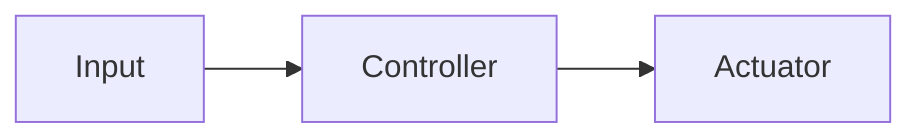

# Day 2 — Item, element, fault, failure

**Read:** ISO 26262-1, Clause 3 — focus on: item, element, fault, failure, error, malfunctioning behavior  
**Time:** 30–40 min  

---

## Step 1: Read (10 min)

For each term, write **your own** one-line definition before checking the standard again.

---

## Step 2: Practical exercise (20 min)

### A. Block diagram

Open `projects/learning-item.md` and add a **block diagram** with 3–5 elements.

Example for wiper system:

```
[Switch] → [Wiper ECU] → [Motor driver] → [Wiper motor]
                ↑
           [Rain sensor]
```

Use text, ASCII, or mermaid:



### B. Fault vs failure table

For each element, list one possible **fault** and resulting **failure** at item level.

| Element | Fault (cause) | Failure (effect at item level) |
|---------|---------------|--------------------------------|
| | | |
| | | |
| | | |

### C. Glossary

Add today's terms to `glossary/terms.md`.

---

## Step 3: Log and commit

`git commit -m "FuSa Day 2: block diagram + fault/failure for [item]"`

---

## Self-check

- [ ] I can explain fault vs failure with an example from my item.
- [ ] Block diagram has clear boundaries.
- [ ] At least 3 elements identified.

**Tomorrow:** Day 3 — ASIL and safety goals introduction.
